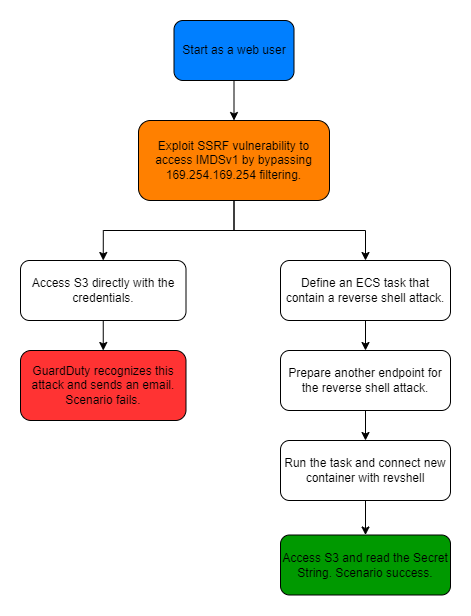

# Scenario: guardduty_bypass_with_ecs

---

**Size**: 

Difficulty: 

Command: `$ ./cloudgoat.py create guardduty_bypass_with_ecs`

## Scenario Resources

---

- 1 ECS with:
    - 1 * ASG with :
        - 1 * EC2
    - 1 * Service (web container)
- 1 * S3
- 1 * Lambda
- CloudWatch
- SES
- GuardDuty enabled

## Scenario Start(s)

---

Scenario starts as a web user.

## Scenario Goal(s)

---

Read flag.txt in S3 without being detected by GuardDuty.

## Summary

---

- An SSRF attack on an EC2 instance running the web allows you to obtain credentials from the EC2 metadata service and use it to access the S3 Bucket. Watch out for Guard Duty when approaching S3.
- This scenario is similar to the detection_evasion scenario. GuardDuty will track the use of the license name you obtained with ssrf and will send you an email if the tracking is successful.So you need to register an email and respond to AWS authentication mail sent to that email before using the scenario.

# SPOILER ALERT: There are spoilers for the scenario blew this point.

---

## Exploitation Route

---

## Scenario Work-through

---

- Attacker accesses the web service of a container inside EC2 managed by ECS.
- The attacker exploits an SSRF vulnerability in a web service to access the EC2 metadata service and steal temporary credentials.
- The attacker defines and executes an ECS task with the authority of the web developer to bypass GuardDuty. Perform a reverse shell attack to access the container been created.
- The attacker accesses S3 at the container to bypass GuardDuty detection. Gets the Secret String and exits the scenario.

