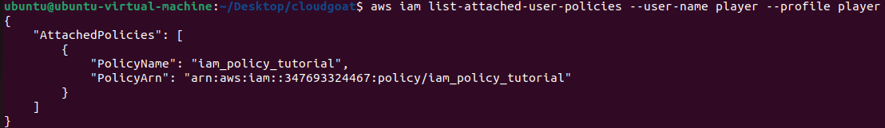
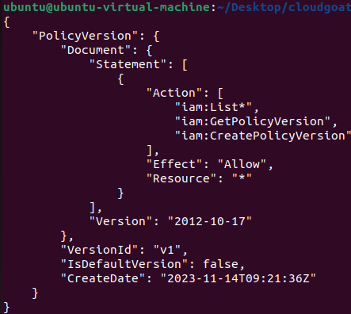
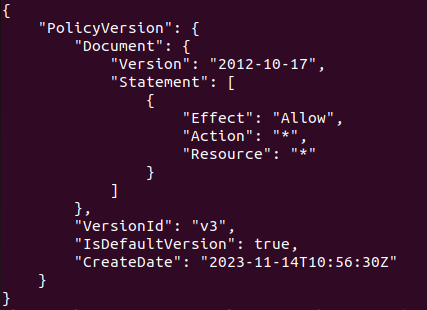

### 시나리오 필요 리소스

- IAM * 1

### 목표

- 최소 권한 원칙의 설명
- 위험 권한의 이해

### 개요

- player는 List* , GetPolicyVersion , CreatePolicyVersion의 권한을 가지고 있음
- CreatePolicyVersion 권한을 통해 자신에게 정책을 할당하여 admin권한으로 상승하는 상황을 연출

### 실행 명령어
`./cloudgoat.py create iam_tutorial_CreatePolicyVersion`

***

### 1. 할당된 정책 확인
IAM에게 할당된 권한을 확인하기 위해서는 먼저 정책의 이름과 ARN을 알아내야 합니다.

`aws iam list-attached-user-policies --user-name [Profile Name] --profile player`

해당 명령어를 통해 특정 IAM에게 할당된 정책을 확인할 수 있습니다.


할당된 정책의 이름과 Arn(Amazon Resource Name)이 보입니다.


### 2. 정책의 권한 확인
정책의 ARN을 확인하였으니 정책에게 할당된 자세한 권한까지 확인해야할 단계입니다.

다음과 같은 명령어를 사용하여 정책에 할당된 권한까지 확인을 할 수 있습니다.

`aws iam get-policy-version --policy-arn <Policy ARN> --version-id <Version ID>`



확인결과 해당 정책에는 총 3가지의 정책이 부여되었습니다.
1. `iam:List*`
2. `iam:GetPolicyVersion`
3. `CreatePolicyVersion`


### 3. 정책 수정
이중에서도 주목해야 할 것은 3번째의 `CreatePolicyVersion`입니다.

IAM에게 할당된 정책은 수정이 가능하며 마치 Git처럼 버전관리가 가능합니다. `CreatePolicyVersion` 권한을 가지고 있다면 현재 자신이 가지고있는 정책을 수정할 수 있습니다.

다음 명령어를 통해 진행해 보겠습니다.

`aws iam create-policy-version \
  --policy-arn <Policy ARN> \
  --policy-document file://./scenairo/iam_tutorial_CreatePolicyVersion/policy.json \
  --set-as-default
`

다음과 같은 명령어를 통해 새로운 정책 버전을 생성하고 기본 정책 버전으로 설정할 수 있으며
, 마지막에 `--set-as-default`옵션을 지정해주어 생성한 권한을 바로 적용해 주었습니다.


### 4. 마무리
이후 정말로 설정되었는지 보겠습니다.

위 사진에서 정책의 버전이 v3라고 되어있으니 v3버전의 정책을 확인해보도록 하겠습니다.

```aws iam get-policy-version --policy-arn <Policy ARN> --version-id v3```



Admin권한으로 잘 수정된것을 확인할 수 있습니다.

