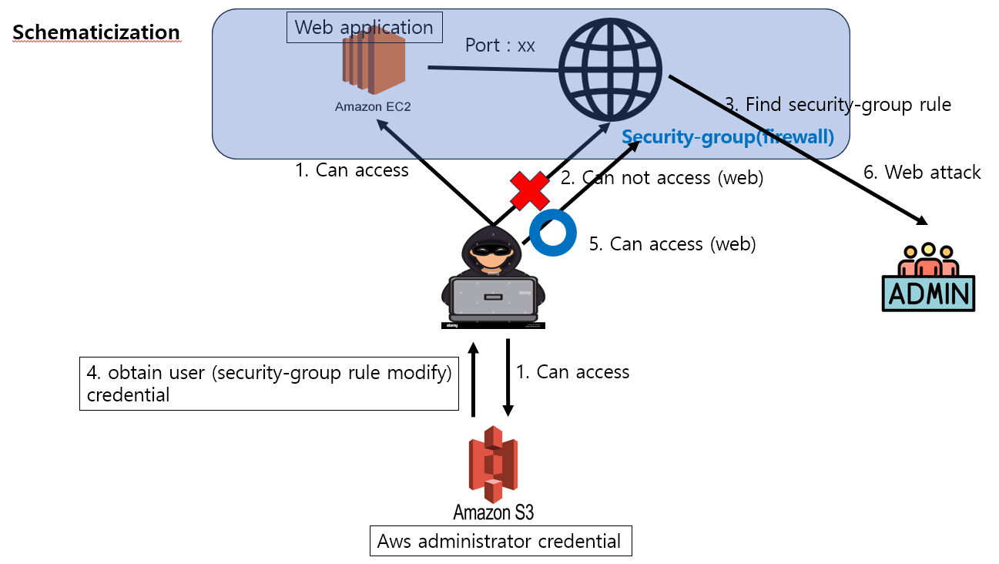

# Scenario: rce_privesc

**Size:** Medium

**Difficulty:** Easy

**Command:** `$ ./cloudgoat.py create rce_privesc`

## Scenario Resources

* 1 EC2
* 1 S3
* 2 IAM Users

## Scenario Start(s)

1. IAM User "cg-startuser"
2. IAM User "cg-scgmod"

## Scenario Goal(s)

Access the SSM parameter store to get the flag
: SSM parameter store에 접근하여 플래그를 얻기.

## Summary
The attacker is divided by ec2 and s3 at the first entry point. ec2 has a web server running on which the developer is preparing the service. During the development and testing process, the developer accidentally saved the firewall administrator's key on s3. The attacker first accesses the web server running on ec2. The developer finds that the web page is not accessible because it is being tested locally. So it's a scenario where an attacker accesses s3 and steals the key, then uses it to modify the firewall rules of ec2, finds vulnerabilities in the web page, and obtain a secret-string by obtaining a role with AWS SSM service access.

: 공격자는 첫 진입점이 ec2, s3로 나누어집니다. ec2에는 개발자가 서비스 준비 중인 웹 서버가 돌아가고 있습니다. 개발자는 개발 및 테스트 과정에서 실수로 s3에 방화벽 관리자의 Key를 저장하였습니다. 공격자는 먼저 ec2에서 동작 중인 웹 서버에 접근합니다. 개발자는 로컬에서 테스트 중이기 때문에 웹 페이지 접속이 불가능하다는 것을 알게됩니다. 그래서 공격자는 s3에 접근하여 Key를 탈취한 후, 이용하여 ec2의 방화벽 룰을 수정하고, 웹 페이지의 취약점을 찾은 후, AWS SSM 서비스 접근권한을 가진 역할을 얻어 secret-string를 얻는 시나리오입니다.

## Exploitation Route(s)

## Route Walkthrough - IAM User “cg-startuser”
[Eng]
1. Start as a regular user. Web applications and s3 returning to ec2 exist. 
2. The user connects to the address found, but cannot connect.
3. You can see that network access is blocked by the security group.
4. After obtaining the access key and secret key of the ec2 firewall administrator found in s3, add rules that can be accessed from the outside through awscli.
5. The attacker accesses the web page again. → Firewall rules apply and attackers can access
6. I noticed that the RCE vulnerability has occurred, and accesses metadata to obtain SSM access rights credentials to obtain the secret-string, which is the value of the "FLAG" parameter.

[Kor]
1. 일반 사용자로 시작. ec2로 돌아가는 웹 어플리케이션과 s3가 존재함. 
2. 사용자는 찾은 주소로 접속을 하지만 접속이 되지 않음.
3. security group(방화벽)에 의해 네트워크 접근이 막힌 것을 알 수있음.
4.  s3에서 찾은ec2 방화벽 관리자의 AccessKey와 SecretKey를 얻은 후, aws cli를 통해 외부에서 접근할 수 있는 규칙을 추가해준다.
5. 공격자는 웹 페이지에 다시 접속한다. → 방화벽규칙이 적용되고 공격자는 접속가능
6. RCE 취약점이 터지는 것을 알았고, 메타데이터에 접근하여 SSM 접근권한이 있는 자격증명을 얻어 “FLAG” 파라미터의 값인 secret-string을 얻으면 시나리오 끝.

A cheat sheet for this route is available [here](./cheat_sheet_rce_privesc.md).
